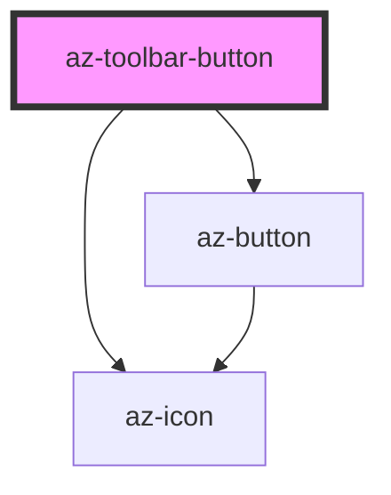

# az-toolbar-button

<!-- Auto Generated Below -->

## Properties

| Property  | Attribute | Description | Type                                                                   | Default     |
| --------- | --------- | ----------- | ---------------------------------------------------------------------- | ----------- |
| `caption` | `caption` |             | `string`                                                               | `''`        |
| `icon`    | `icon`    |             | `string`                                                               | `''`        |
| `type`    | `type`    |             | `"danger" \| "info" \| "plain" \| "primary" \| "success" \| "warning"` | `'primary'` |

## Dependencies

### Depends on

- [az-button](../../components/button)
- [az-icon](../../components/icons)

### Graph

----------------------------------------------

*Built with [StencilJS](https://stenciljs.com/)*
