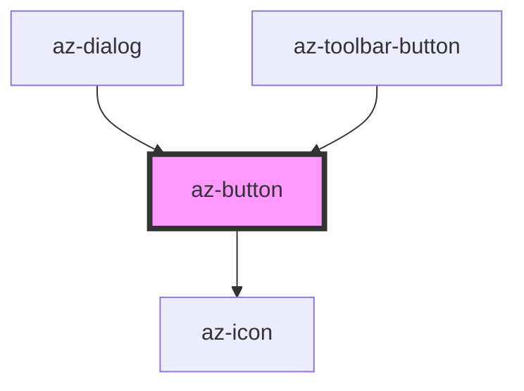

# az-button

<!-- Auto Generated Below -->

## Properties

| Property       | Attribute       | Description | Type                                                                           | Default     |
| -------------- | --------------- | ----------- | ------------------------------------------------------------------------------ | ----------- |
| `caption`      | `caption`       |             | `string`                                                                       | `''`        |
| `circle`       | `circle`        |             | `boolean`                                                                      | `false`     |
| `disabled`     | `disabled`      |             | `boolean`                                                                      | `false`     |
| `icon`         | `icon`          |             | `string`                                                                       | `''`        |
| `iconPosition` | `icon-position` |             | `string`                                                                       | `'left'`    |
| `round`        | `round`         |             | `boolean`                                                                      | `false`     |
| `size`         | `size`          |             | `"extra-large" \| "extra-small" \| "large" \| "medium" \| "normal" \| "small"` | `'normal'`  |
| `type`         | `type`          | Button type | `"danger" \| "info" \| "plain" \| "primary" \| "success" \| "warning"`         | `'primary'` |

## Dependencies

### Used by

 - [az-dialog](../dialog)
 - [az-toolbar-button](../../advanced/toolbar-button)

### Depends on

- [az-icon](../icons)

### Graph

----------------------------------------------

*Built with [StencilJS](https://stenciljs.com/)*
