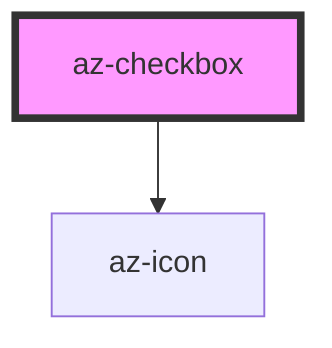

# az-checkbox

<!-- Auto Generated Below -->

## Properties

| Property        | Attribute       | Description | Type      | Default |
| --------------- | --------------- | ----------- | --------- | ------- |
| `caption`       | `caption`       |             | `string`  | `''`    |
| `checked`       | `checked`       |             | `boolean` | `false` |
| `indeterminate` | `indeterminate` |             | `boolean` | `false` |

## Events

| Event     | Description | Type               |
| --------- | ----------- | ------------------ |
| `changed` |             | `CustomEvent<any>` |

## Methods

### `toJson(detailed?: boolean) => Promise<{ tag: string; caption: string; checked: boolean; } & { indeterminate: boolean; }>`

#### Returns

Type: `Promise<{ tag: string; caption: string; checked: boolean; } & { indeterminate: boolean; }>`

### `toggle() => Promise<void>`

#### Returns

Type: `Promise<void>`

## Dependencies

### Depends on

- [az-icon](../icons)

### Graph

----------------------------------------------

*Built with [StencilJS](https://stenciljs.com/)*
