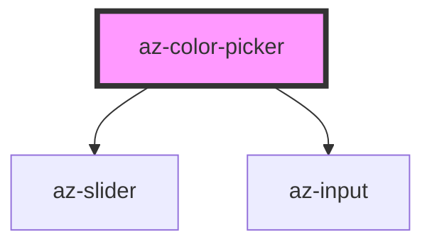

# az-color-picker

<!-- Auto Generated Below -->

## Properties

| Property  | Attribute | Description | Type     | Default  |
| --------- | --------- | ----------- | -------- | -------- |
| `caption` | `caption` |             | `string` | `''`     |
| `color`   | `color`   |             | `string` | `'#f00'` |

## Events

| Event     | Description | Type               |
| --------- | ----------- | ------------------ |
| `changed` |             | `CustomEvent<any>` |

## Dependencies

### Depends on

- [az-slider](../slider)
- [az-input](../input)

### Graph

----------------------------------------------

*Built with [StencilJS](https://stenciljs.com/)*
