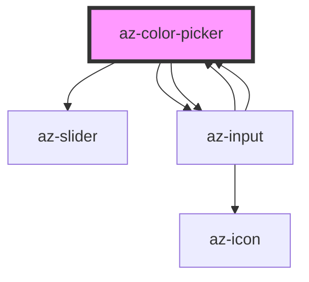

# az-color-picker

<!-- Auto Generated Below -->

## Properties

| Property    | Attribute   | Description | Type      | Default                           |
| ----------- | ----------- | ----------- | --------- | --------------------------------- |
| `caption`   | `caption`   |             | `string`  | `''`                              |
| `color`     | `color`     |             | `string`  | `AzColorPicker.defaultColor`      |
| `colorfmt`  | `colorfmt`  |             | `string`  | `ColorFormat[this.colorfmtIndex]` |
| `readonly`  | `readonly`  |             | `boolean` | `false`                           |
| `showinput` | `showinput` |             | `boolean` | `true`                            |

## Events

| Event     | Description | Type               |
| --------- | ----------- | ------------------ |
| `changed` |             | `CustomEvent<any>` |

## Dependencies

### Used by

 - [az-input](../input)

### Depends on

- [az-slider](../slider)
- [az-input](../input)
- [az-input](../input)

### Graph

----------------------------------------------

*Built with [StencilJS](https://stenciljs.com/)*
