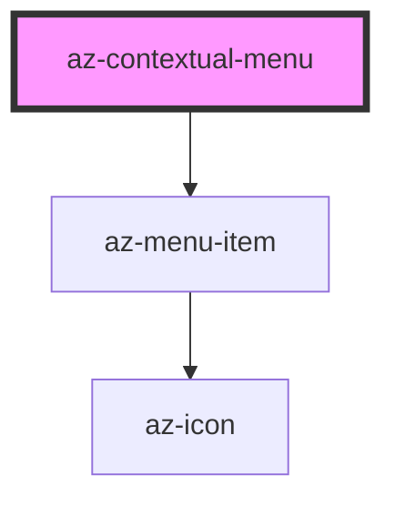

# az-contextual-menu

<!-- Auto Generated Below -->

## Properties

| Property       | Attribute      | Description | Type     | Default         |
| -------------- | -------------- | ----------- | -------- | --------------- |
| `caption`      | `caption`      |             | `string` | `''`            |
| `closedelay`   | `closedelay`   |             | `number` | `500`           |
| `closeevent`   | `closeevent`   |             | `string` | `''`            |
| `parent`       | `parent`       |             | `string` | `'body'`        |
| `popupalign`   | `popupalign`   |             | `string` | `''`            |
| `triggerevent` | `triggerevent` |             | `string` | `'contextmenu'` |

## Events

| Event    | Description | Type               |
| -------- | ----------- | ------------------ |
| `showed` |             | `CustomEvent<any>` |

## Dependencies

### Depends on

- [az-menu-item](../menu-item)

### Graph

----------------------------------------------

*Built with [StencilJS](https://stenciljs.com/)*
