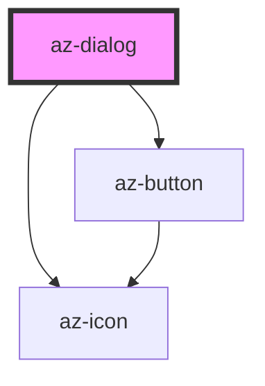

# az-dialog

<!-- Auto Generated Below -->

## Properties

| Property  | Attribute | Description | Type      | Default |
| --------- | --------- | ----------- | --------- | ------- |
| `caption` | `caption` |             | `string`  | `''`    |
| `fixed`   | `fixed`   |             | `boolean` | `false` |

## Events

| Event    | Description | Type               |
| -------- | ----------- | ------------------ |
| `closed` |             | `CustomEvent<any>` |

## Dependencies

### Depends on

- [az-icon](../icons)
- [az-button](../button)

### Graph

----------------------------------------------

*Built with [StencilJS](https://stenciljs.com/)*
