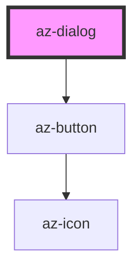

# az-dialog

<!-- Auto Generated Below -->

## Properties

| Property         | Attribute        | Description | Type                          | Default               |
| ---------------- | ---------------- | ----------- | ----------------------------- | --------------------- |
| `buttons`        | --               |             | `ButtonConfig[]`              | `getDefaultButtons()` |
| `canclose`       | --               |             | `(reason: string) => boolean` | `undefined`           |
| `caption`        | `caption`        |             | `string`                      | `''`                  |
| `clickmaskclose` | `clickmaskclose` |             | `boolean`                     | `true`                |
| `closable`       | `closable`       |             | `boolean`                     | `true`                |
| `content`        | `content`        |             | `string`                      | `''`                  |
| `fixed`          | `fixed`          |             | `boolean`                     | `false`               |
| `mask`           | `mask`           |             | `boolean`                     | `false`               |
| `modal`          | `modal`          |             | `boolean`                     | `true`                |

## Events

| Event    | Description | Type               |
| -------- | ----------- | ------------------ |
| `closed` |             | `CustomEvent<any>` |
| `hid`    |             | `CustomEvent<any>` |

## Methods

### `close(reason?: string) => Promise<void>`

#### Returns

Type: `Promise<void>`

### `hide() => Promise<this>`

#### Returns

Type: `Promise<this>`

### `show() => Promise<this>`

#### Returns

Type: `Promise<this>`

## Dependencies

### Depends on

- [az-button](../button)

### Graph

----------------------------------------------

*Built with [StencilJS](https://stenciljs.com/)*
