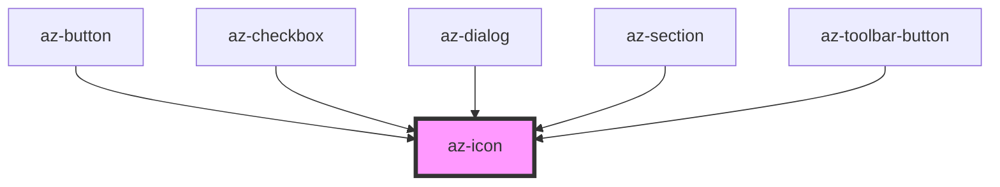

# az-icon

<!-- Auto Generated Below -->

## Properties

| Property   | Attribute  | Description | Type               | Default   |
| ---------- | ---------- | ----------- | ------------------ | --------- |
| `color`    | `color`    |             | `string`           | `'white'` |
| `height`   | `height`   |             | `number \| string` | `12`      |
| `icon`     | `icon`     |             | `string`           | `''`      |
| `register` | `register` |             | `boolean`          | `false`   |
| `width`    | `width`    |             | `number \| string` | `12`      |

## Dependencies

### Used by

 - [az-button](../button)
 - [az-checkbox](../checkbox)
 - [az-dialog](../dialog)
 - [az-section](../section)
 - [az-toolbar-button](../../advanced/toolbar-button)

### Graph

----------------------------------------------

*Built with [StencilJS](https://stenciljs.com/)*
