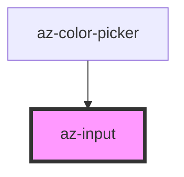

# az-input

<!-- Auto Generated Below -->

## Properties

| Property         | Attribute        | Description | Type               | Default     |
| ---------------- | ---------------- | ----------- | ------------------ | ----------- |
| `autocapitalize` | `autocapitalize` |             | `string`           | `undefined` |
| `autocomplete`   | `autocomplete`   |             | `string`           | `undefined` |
| `autocorrect`    | `autocorrect`    |             | `string`           | `undefined` |
| `caption`        | `caption`        |             | `string`           | `''`        |
| `native`         | --               |             | `HTMLInputElement` | `undefined` |
| `spellcheck`     | `spellcheck`     |             | `boolean`          | `true`      |
| `type`           | `type`           |             | `string`           | `''`        |
| `value`          | `value`          |             | `string`           | `''`        |

## Dependencies

### Used by

 - [az-color-picker](../color-picker)

### Graph

----------------------------------------------

*Built with [StencilJS](https://stenciljs.com/)*
