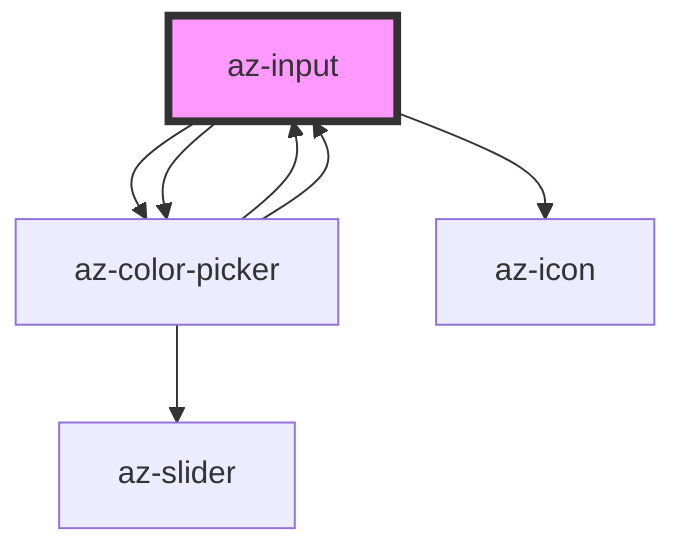

# az-input

<!-- Auto Generated Below -->

## Properties

| Property         | Attribute        | Description | Type      | Default      |
| ---------------- | ---------------- | ----------- | --------- | ------------ |
| `autocapitalize` | `autocapitalize` |             | `string`  | `'off'`      |
| `autocomplete`   | `autocomplete`   |             | `string`  | `'off'`      |
| `autocorrect`    | `autocorrect`    |             | `string`  | `'off'`      |
| `caption`        | `caption`        |             | `string`  | `''`         |
| `clearable`      | `clearable`      |             | `boolean` | `false`      |
| `constrain`      | `constrain`      |             | `boolean` | `false`      |
| `max`            | `max`            |             | `number`  | `undefined`  |
| `min`            | `min`            |             | `number`  | `undefined`  |
| `popupalign`     | `popupalign`     |             | `string`  | `'left top'` |
| `readonly`       | `readonly`       |             | `boolean` | `false`      |
| `spellcheck`     | `spellcheck`     |             | `boolean` | `true`       |
| `type`           | `type`           |             | `string`  | `''`         |
| `value`          | `value`          |             | `string`  | `''`         |

## Methods

### `clear() => Promise<void>`

#### Returns

Type: `Promise<void>`

### `toJson(detailed?: boolean) => Promise<{ tag: string; caption: string; value: string; } & { type: string; clearable: boolean; }>`

#### Returns

Type: `Promise<{ tag: string; caption: string; value: string; } & { type: string; clearable: boolean; }>`

## Dependencies

### Used by

 - [az-color-picker](../color-picker)

### Depends on

- [az-color-picker](../color-picker)
- [az-icon](../icons)
- [az-color-picker](../color-picker)

### Graph

----------------------------------------------

*Built with [StencilJS](https://stenciljs.com/)*
