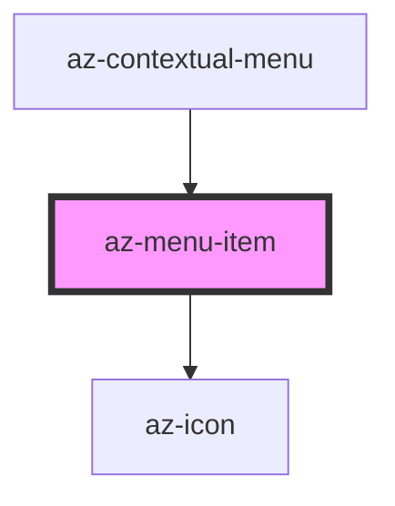

# az-menu-item

<!-- Auto Generated Below -->

## Properties

| Property  | Attribute | Description | Type                                                                   | Default   |
| --------- | --------- | ----------- | ---------------------------------------------------------------------- | --------- |
| `action`  | `action`  |             | `string`                                                               | `''`      |
| `caption` | `caption` |             | `string`                                                               | `''`      |
| `icon`    | `icon`    |             | `string`                                                               | `''`      |
| `type`    | `type`    |             | `"danger" \| "info" \| "plain" \| "primary" \| "success" \| "warning"` | `'plain'` |

## Events

| Event      | Description | Type               |
| ---------- | ----------- | ------------------ |
| `selected` |             | `CustomEvent<any>` |

## Dependencies

### Used by

 - [az-contextual-menu](../contextual-menu)

### Depends on

- [az-icon](../icons)

### Graph

----------------------------------------------

*Built with [StencilJS](https://stenciljs.com/)*
