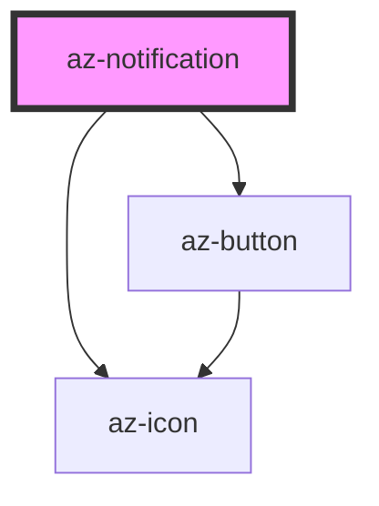

# az-notification

<!-- Auto Generated Below -->

## Properties

| Property    | Attribute   | Description | Type                                                                                                                                             | Default       |
| ----------- | ----------- | ----------- | ------------------------------------------------------------------------------------------------------------------------------------------------ | ------------- |
| `buttons`   | --          |             | `ButtonConfig[]`                                                                                                                                 | `[]`          |
| `caption`   | `caption`   |             | `string`                                                                                                                                         | `''`          |
| `closable`  | `closable`  |             | `boolean`                                                                                                                                        | `true`        |
| `html`      | `html`      |             | `string`                                                                                                                                         | `''`          |
| `icon`      | `icon`      |             | `string`                                                                                                                                         | `''`          |
| `indicator` | `indicator` |             | `boolean`                                                                                                                                        | `true`        |
| `message`   | `message`   |             | `string`                                                                                                                                         | `''`          |
| `placement` | `placement` |             | `"bottom-center" \| "bottom-left" \| "bottom-right" \| "center" \| "left-center" \| "right-center" \| "top-center" \| "top-left" \| "top-right"` | `'top-right'` |
| `timeout`   | `timeout`   |             | `number`                                                                                                                                         | `3000`        |
| `type`      | `type`      |             | `"danger" \| "info" \| "plain" \| "primary" \| "success" \| "warning"`                                                                           | `'primary'`   |

## Events

| Event    | Description | Type               |
| -------- | ----------- | ------------------ |
| `closed` |             | `CustomEvent<any>` |
| `showed` |             | `CustomEvent<any>` |

## Methods

### `close(reason?: string) => Promise<void>`

#### Returns

Type: `Promise<void>`

### `show() => Promise<void>`

#### Returns

Type: `Promise<void>`

## Dependencies

### Depends on

- [az-button](../button)
- [az-icon](../icons)

### Graph

----------------------------------------------

*Built with [StencilJS](https://stenciljs.com/)*
