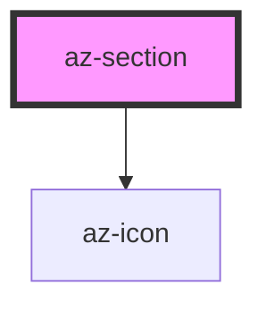

# az-section

<!-- Auto Generated Below -->

## Properties

| Property      | Attribute     | Description | Type      | Default |
| ------------- | ------------- | ----------- | --------- | ------- |
| `caption`     | `caption`     |             | `string`  | `''`    |
| `collapsable` | `collapsable` |             | `boolean` | `true`  |
| `collapsed`   | `collapsed`   |             | `boolean` | `false` |

## Dependencies

### Depends on

- [az-icon](../icons)

### Graph

----------------------------------------------

*Built with [StencilJS](https://stenciljs.com/)*
