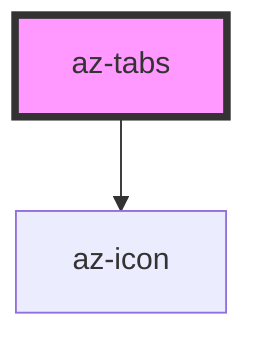

# az-tabs

<!-- Auto Generated Below -->

## Properties

| Property      | Attribute      | Description | Type              | Default |
| ------------- | -------------- | ----------- | ----------------- | ------- |
| `activeIndex` | `active-index` |             | `number`          | `-1`    |
| `indicator`   | `indicator`    |             | `boolean`         | `true`  |
| `items`       | --             |             | `TabItemConfig[]` | `[]`    |

## Events

| Event    | Description | Type               |
| -------- | ----------- | ------------------ |
| `closed` |             | `CustomEvent<any>` |

## Methods

### `addItem(it: string | TabItemConfig) => Promise<void>`

#### Returns

Type: `Promise<void>`

### `removeItem(caption: string) => Promise<void>`

#### Returns

Type: `Promise<void>`

### `removeItemAt(index: number) => Promise<void>`

#### Returns

Type: `Promise<void>`

## Dependencies

### Depends on

- [az-icon](../icons)

### Graph

----------------------------------------------

*Built with [StencilJS](https://stenciljs.com/)*
